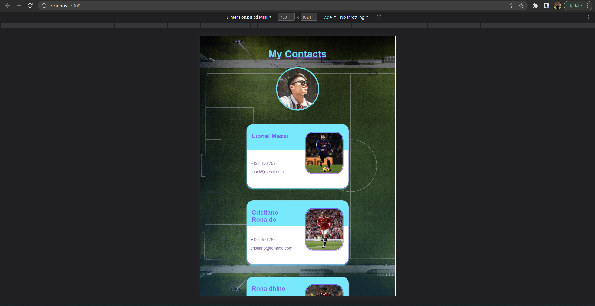
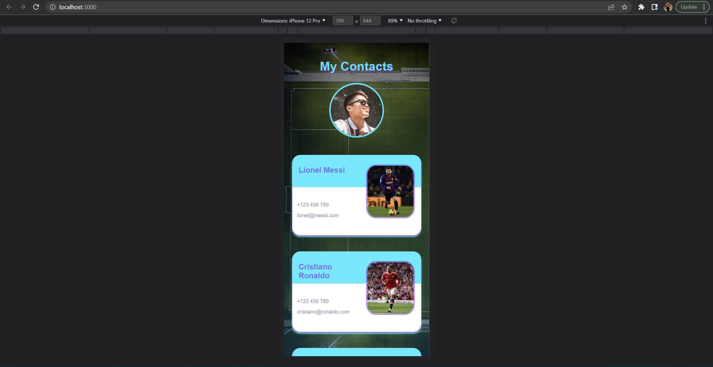
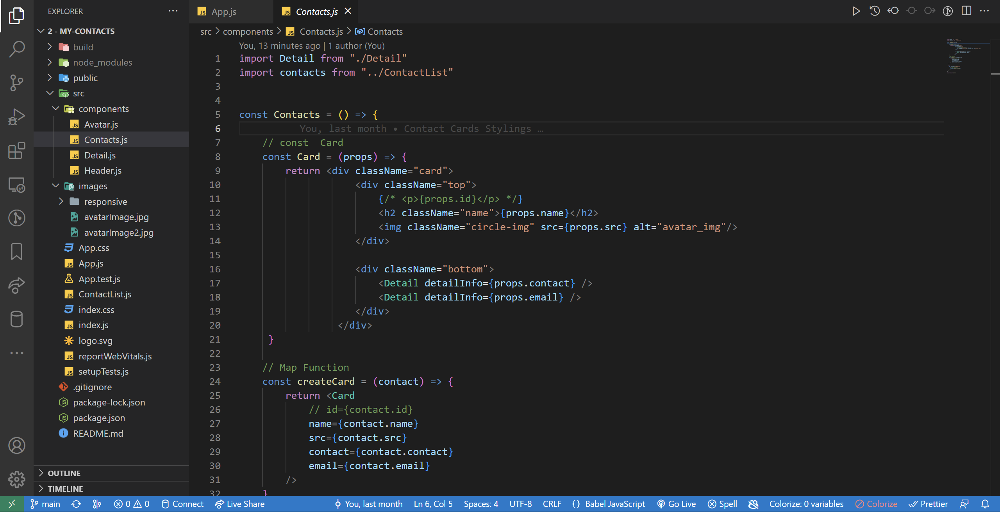

<!-- markdownlint-configure-file {
  "MD013": {
    "code_blocks": false,
    "tables": false
  },
  "MD033": false,
  "MD041": false
} -->

  

# My Contacts: Football Icons

This is the My Contacts Project by Udemy - Web Development Bootcamp 2022

It is made with React JS utilizing the Props Feature.

My Contacts: Lionel Messi, Cristiano Ronaldo and Ronaldhino

My Contacts Project - Udemy - Web Development Bootcamp 2022

## Website

🖥️ [https://steady-entremet-c7272f.netlify.app/]

✍️ Project by John Cañero

## Responsive Design

🪟: [Desktop - Tablet - Mobile]

